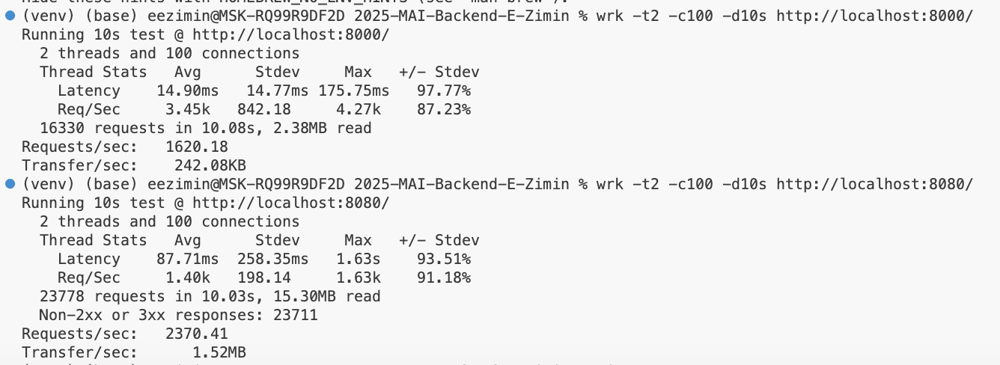

# 2025-MAI-Backend-E-Zimin

Для лабораторных работ по курсу "Программная инженерия".

## Лабораторная работа 1

Для демонстрации работы функции прописать в терминале:

`python lru_cache.py`

## Лабораторная работа 2

**Тестирование Gunicorn**

`wrk -t2 -c100 -d10s http://localhost:8000/`

**Тестирование Nginx**

`wrk -t2 -c100 -d10s http://localhost:8080/`

## Лабораторная работа 3

`python manage.py runserver`

Профиль: http://localhost:8000/api/profile/

Список продуктов: http://localhost:8000/api/products/

Страница категории: http://localhost:8000/api/category/fruits/

POST:
`curl -X POST http://localhost:8080/api/create-product/ \
-H "Content-Type: application/json" \
-d '{"name": "Banana", "calories": 89, "protein": 1.1, "fat": 0.3, "carbs": 23}`

## Лабораторная работа 4

Подключение к БД:

`psql -U nutrition_user -d nutrition_db -h localhost`

Получение списка таблиц: `\dt`

Получение списка продуктов с КБЖУ:
`SELECT * FROM products_product;`

## Лабораторная работа 5

1. Ищем продукт apple
`http://localhost:8080/api/search/?q=apple`

2. Список продуктов:
`http://localhost:8080/api/products/`

`curl -X POST http://localhost:8080/api/products/create/ \
-H "Content-Type: application/json" \
-d '{"name": "Banana", "calories": 89, "protein": 1.1, "fat": 0.3, "carbs": 23}'`

## Лабораторная работа 7

Получить список продуктов: http://localhost:8000/api/products/

Получение детальной информации о продукте: http://localhost:8000/api/products/1/

Создание нового продукта: 

`curl -X POST http://localhost:8000/api/products/ \
-H "Content-Type: application/json" \
-d '{"name": "New Product", "calories": 100, "protein": 5.0, "fat": 3.0, "carbs": 10.0}'`

Обновление продукта:

`curl -X PUT http://localhost:8000/api/products/1/ \
-H "Content-Type: application/json" \
-d '{"name": "Updated Product", "calories": 200, "protein": 10.0, "fat": 5.0, "carbs": 20.0}'`

Удаление продукта:

`curl -X DELETE http://localhost:8000/api/products/1/`

## Лабораторная работа 9

Запуск тестов:

`python manage.py test products` 

`python selenium_tests.py`

Узнать степень покрытия тестами с помощью библиотеки coverage.

1. Настроил файл .coveragerc с настройками
2. `coverage run --source=products manage.py test products`
3. `coverage report`

## Лабораторная работа 10

Basic-авторизация: зайти по адресу и ввести логин user2, пароля нет

http://localhost:8080/secret/

